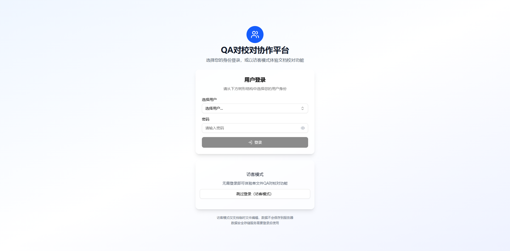
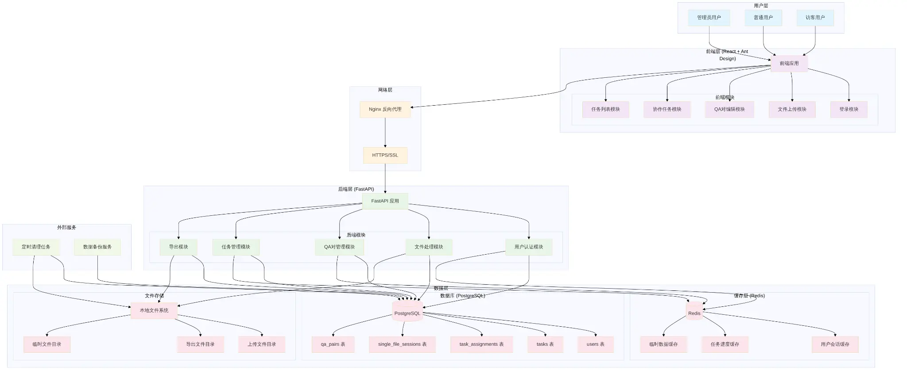

# QA对校对协作平台 V2

[English](README_en.md) | 中文

## 📖 项目简介

QA对校对协作平台是一个用于高效管理和协作校对QA（Question-Answer）对的Web应用程序。它旨在帮助团队成员对大量的QA数据进行审阅、编辑、标记和导出，支持单文件校对和多用户协作任务。

## ✨ 主要功能

### 🔐 用户认证与管理
- **用户登录**: 支持通过预设用户列表进行登录，区分管理员和普通用户
- **会话管理**: 用户登录后获取会话Token，用于后续API请求认证
- **权限控制**: 根据用户角色（超级管理员、管理员、普通用户）和任务分配，提供不同的操作权限

### 📄 单文件校对
- **文件上传**: 支持上传JSONL格式的QA对文件进行校对
- **QA对列表展示**: 分页展示QA对，支持关键词搜索
- **QA对编辑**: 可对单个QA对的Prompt和Completion进行修改，并支持标记为删除
- **数据导出**: 支持将校对后的QA对导出为JSONL或Excel格式

### 👥 协作任务管理
- **任务创建**: 管理员可上传JSONL文件，创建协作校对任务，并分配给多个用户
- **任务分配**: 支持将QA对按数量分配给不同的团队成员
- **任务进度追踪**: 查看任务整体进度和每个成员的完成情况
- **协作编辑**: 团队成员可编辑分配给自己的QA对
- **任务提交**: 成员完成分配的QA对后可提交任务部分
- **合并与导出**: 任务创建者可合并所有已提交的任务部分，并导出为JSONL或Excel格式

### 📋 任务列表
- **待办任务**: 展示当前用户待处理的单文件校对任务和协作任务
- **已完成任务**: 展示当前用户已完成的任务，并提供下载已导出文件的链接

### ⚙️ 系统管理 (预留)
- **用户组管理**: 管理员可创建、编辑和删除用户组
- **管理员组管理**: 管理员可创建、编辑和删除管理员组
- **数据追溯**: 查看QA对的编辑历史和操作记录

## 🛠️ 技术栈

### 前端
- **框架**: React.js
- **UI组件**: Ant Design
- **构建工具**: Vite
- **路由**: React Router DOM
- **样式**: Tailwind CSS, PostCSS

### 后端
- **框架**: Flask
- **数据库**: SQLAlchemy (ORM), SQLite (开发环境默认，可配置为PostgreSQL)
- **API**: RESTful API
- **认证**: JWT (PyJWT)
- **缓存**: Redis (预留，根据 requirements.txt 推断)
- **文件处理**: openpyxl (Excel)
- **其他**: Flask-CORS, Werkzeug, python-dotenv, bcrypt

## 🏗️ 系统架构

系统采用前后端分离的架构，通过RESTful API进行通信。核心组件包括：

- **用户层**: 管理员用户、普通用户、访客用户
- **前端层**: 基于React的Web应用，提供用户界面和交互逻辑
- **网络层**: Nginx反向代理（可选），HTTPS/SSL加密
- **后端层**: 基于Flask的API服务，处理业务逻辑、数据存储和文件操作
- **数据层**: PostgreSQL数据库（或SQLite），Redis缓存，本地文件系统用于文件存储
- **外部服务**: 定时清理任务、数据备份服务（预留）



## 🚀 部署指南

### 概述

本文档旨在为QA对校对协作平台的部署和测试提供详细的指导。本平台采用前后端分离架构，前端基于React，后端基于Flask。本指南将涵盖开发环境的搭建、依赖安装、数据库初始化以及服务的启动步骤。

> **重要提示**: 本指南假设您在一个基于Linux (Ubuntu) 的环境中进行部署。所有命令均在终端中执行。请确保您的系统满足所有先决条件。

### 环境准备

在开始部署之前，请确保您的系统已安装以下软件和工具：

#### 操作系统
- Ubuntu 20.04 LTS 或更高版本 (推荐)

#### 核心依赖

**Git**: 用于克隆项目代码
```bash
sudo apt update
sudo apt install git -y
```

**Python 3.9 或更高版本**: 后端服务运行环境
```bash
sudo apt install python3.9 python3.9-venv python3-pip -y
# 确保pip指向python3.9
sudo update-alternatives --install /usr/bin/python3 python3 /usr/bin/python3.9 1
sudo update-alternatives --install /usr/bin/pip pip /usr/bin/pip3 1
```

**Node.js 18.x 或更高版本**: 前端构建和运行环境
```bash
curl -fsSL https://deb.nodesource.com/setup_18.x | sudo -E bash -
sudo apt install -y nodejs
# 验证安装
node -v
npm -v
```

**npm 或 Yarn**: 前端包管理器
```bash
sudo npm install -g yarn # 如果选择使用yarn
```

### 项目部署

#### 1. 获取项目代码

首先，您需要从版本控制系统（例如Git仓库）克隆项目代码到本地。如果您已经通过压缩包获取了项目，请将其解压到您希望部署的目录。

```bash
git clone https://github.com/tianruilint/qa-proofreading-platform.git
cd qa-proofreading-platform
```

> 如果您是通过压缩包获取的项目，请确保您已将其解压，并且当前终端的工作目录位于解压后的 `qa-proofreading-platform` 目录下。本指南后续的所有路径都将基于此根目录。

#### 2. 后端服务部署

后端服务使用Python Flask框架。以下是部署步骤：

**创建并激活Python虚拟环境**

为了隔离项目依赖，强烈建议使用虚拟环境。

```bash
python3 -m venv venv
source venv/bin/activate
```

> **注意**: 在Windows系统上，激活命令可能是 `.\venv\Scripts\activate`。

**安装后端依赖**

激活虚拟环境后，安装 `requirements.txt` 中列出的所有Python包。

```bash
pip install -r requirements.txt
```

**数据库初始化**

平台默认使用SQLite数据库进行开发和测试，数据库文件将生成在 `instance/` 目录下。您需要运行初始化脚本来创建数据库表结构并填充初始数据。

```bash
python init_sqlite_db.py
```

运行此脚本后，您将看到类似以下输出，其中包含默认的登录凭据：

```
正在删除旧的数据库表...
旧表已删除。
正在创建新的数据库表...
新表已成功创建。
正在填充初始数据...
数据库初始化数据填充完成。
-----------------------------------------
初始用户凭据:
  - 超级管理员: superadmin / password
  - 管理员: adminuser / password
  - 普通用户: user1 / password, user2 / password
-----------------------------------------
```

> **注意**: 如果您需要使用PostgreSQL等生产级数据库，请修改 `src/config.py` 中的数据库配置，并确保已安装相应的数据库驱动（例如 `psycopg2-binary`）。本指南不详细展开PostgreSQL的配置。

**启动后端服务**

在激活的虚拟环境中，运行Flask应用。

```bash
python src/main.py
```

后端服务将默认运行在 `http://localhost:5001`。您应该会看到Flask的启动信息。

> **提示**: 如果您希望后端服务在后台持续运行，可以使用 `nohup` 或 `screen/tmux` 等工具，或者在生产环境中使用Gunicorn等WSGI服务器。

#### 3. 前端服务部署

前端服务使用React和Vite构建。以下是部署步骤：

**进入前端项目目录**

前端代码位于 `frontend/` 子目录中。

```bash
# cd /path/to/qa-proofreading-platform/frontend
```

**安装前端依赖**

使用npm或yarn安装前端项目所需的JavaScript依赖。

```bash
npm install
# 或者
# yarn install
```

**启动前端开发服务器**

使用Vite启动前端开发服务器。这将编译前端代码并在本地提供服务。

```bash
npm run dev
# 或者
# yarn dev
```

前端开发服务器将默认运行在 `http://localhost:5173`。Vite会自动打开浏览器并访问此地址。

#### 4. 访问平台

当后端和前端服务都成功启动后，您可以通过浏览器访问前端地址来使用平台：

**平台访问地址**: `http://localhost:5173`

您可以使用数据库初始化时提供的默认用户凭据进行登录和测试。

### 生产环境部署建议 (可选)

对于生产环境部署，建议采取以下措施以提高性能、稳定性和安全性：

**使用Gunicorn作为WSGI服务器**: 替代Flask自带的开发服务器。

```bash
pip install gunicorn
gunicorn -w 4 -b 0.0.0.0:5001 src.main:app
```

**使用Nginx作为反向代理**: 处理静态文件、负载均衡和HTTPS。
- 配置Nginx将所有 `/api/v1` 请求转发到后端Gunicorn服务
- 配置Nginx提供前端构建后的静态文件
- 配置SSL证书以启用HTTPS

**前端生产构建**: 运行 `npm run build` (或 `yarn build`) 命令生成优化后的静态文件，然后通过Nginx或类似的Web服务器提供这些文件。

```bash
npm run build
```

构建后的文件通常位于 `dist/` 目录下。

**数据库**: 将SQLite替换为PostgreSQL等更强大的关系型数据库。

**日志管理**: 配置后端日志输出到文件或日志服务，便于监控和故障排查。

**环境变量**: 使用更安全的机制管理敏感配置（如数据库连接字符串、密钥），而不是直接硬编码。

### 常见问题与故障排除

- **端口占用**: 如果前端或后端服务启动失败，提示端口已被占用，您可以尝试修改 `vite.config.js` (前端) 或 `src/main.py` (后端) 中的端口号，或者查找并终止占用端口的进程。

- **依赖安装失败**: 检查您的网络连接，或者尝试更换npm/pip的镜像源。

- **数据库连接错误**: 确保数据库服务正在运行，并且连接字符串配置正确。

- **前端白屏**: 检查浏览器控制台是否有JavaScript错误，确保后端服务已启动且API请求正常。

- **权限问题**: 确保您的用户对项目目录有读写权限，尤其是在安装依赖和创建文件时。

## 📚 API接口文档

详细的API接口规范请参考 `api_specification.md` 文件。

## 🤝 贡献与开发

### 开发环境搭建

**克隆仓库**
```bash
git clone https://github.com/tianruilint/qa-proofreading-platform.git
cd qa-proofreading-platform
```

**后端环境搭建**

创建并激活Python虚拟环境：
```bash
python3 -m venv venv
source venv/bin/activate  # Linux/macOS
# venv\Scripts\activate   # Windows
```

安装后端依赖：
```bash
pip install -r requirements.txt
```

初始化数据库：
```bash
python init_sqlite_db.py
```

运行后端服务：
```bash
python src/main.py
```

后端服务默认运行在 `http://localhost:5001`。

**前端环境搭建**

进入前端目录：
```bash
cd frontend  # 如果前端代码在单独的frontend目录下
# 或者直接在项目根目录执行，如果前端文件在根目录
```

安装前端依赖：
```bash
npm install
# 或 yarn install
```

运行前端服务：
```bash
npm run dev
# 或 yarn dev
```

前端服务默认运行在 `http://localhost:5173`。

### 项目结构

```
qa-proofreading-platform/
├── api.js                      # 前端API调用封装
├── api_specification.md        # 后端API接口文档
├── App.css                     # 全局CSS样式
├── App.jsx                     # React主应用组件
├── CHANGELOG.md                # 变更日志
├── components/                 # React组件目录
├── database_design.sql         # 数据库设计SQL脚本
├── data_flow.mmd               # 数据流图定义文件
├── data_flow.png               # 数据流图图片
├── docs/                       # 文档目录
│   ├── qa-proofreading-prd.md  # 产品需求文档
│   └── 部署测试指南.md         # 部署测试指南
├── exports/                    # 导出文件存放目录
├── frontend/                   # 前端项目根目录 (如果存在)
├── hooks/                      # React Hooks
├── image.png                   # 项目截图/示意图
├── index.html                  # 前端HTML入口文件
├── init_sqlite_db.py           # 数据库初始化脚本
├── instance/                   # Flask实例配置和SQLite数据库文件
├── lib/                        # 辅助库或工具函数
├── logs/                       # 日志文件存放目录
├── main.jsx                    # React应用入口
├── node_modules/               # 前端依赖
├── package-lock.json           # 前端依赖锁定文件
├── package.json                # 前端项目配置
├── pasted_content.txt          # 粘贴内容示例
├── postcss.config.js           # PostCSS配置
├── README.md                   # 项目说明文件 (当前文件)
├── requirements.txt            # 后端Python依赖
├── src/                        # 后端源代码目录
│   ├── config.py               # 配置管理
│   ├── main.py                 # Flask应用入口
│   ├── models/                 # 数据库模型定义
│   ├── routes/                 # API路由定义
│   └── static/                 # 静态文件 (如果前端构建到此处)
├── system_architecture.mmd     # 系统架构图定义文件
├── system_architecture.png     # 系统架构图图片
├── tailwind.config.js          # Tailwind CSS配置
├── test_data.jsonl             # 测试数据
├── test_qa_data.jsonl          # 测试QA数据
├── uploads/                    # 上传文件存放目录
├── useAuth.js                  # 认证相关Hook
└── venv/                       # Python虚拟环境
```

## 📝 变更日志

请参考 `CHANGELOG.md` 文件。

## 📄 许可证

本项目采用 [MIT License](LICENSE.md) 许可证开源。

